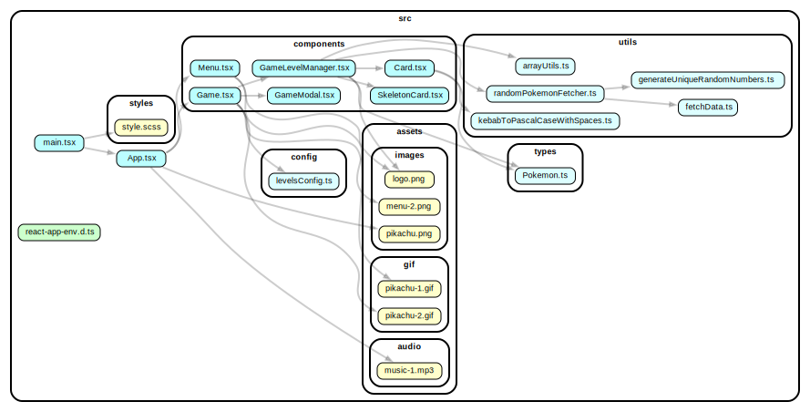

# Memory Game

-   Live: [Pokemon Memory Game Live](https://pokemon-memorycard-game.netlify.app/)

## Description

Challenge your memory with the Pokemon Memory Game, a fun and interactive web-based game built using React. Flip over the cards to match pairs of Pokemon and test your memory skills. The game features multiple levels, a scoring system, and a modal to show your progress.

## Features

-   **Card Matching**: Flip over cards to find matching pairs of Pokemon.
-   **Multiple Levels**: Progress through different levels with increasing difficulty.
-   **Scoring System**: Keep track of your current score and highest score.
-   **Modal Feedback**: Receive feedback through modals for game completion or loss.
-   **Responsive Design**: Play the game on various devices with a responsive layout.

## Gameplay

1.  Access the [Pokemon Memory Game Live](https://pokemon-memorycard-game.netlify.app/).
2.  Click on the cards to flip them and reveal the Pokemon.
3.  Match pairs of Pokemon to increase your score.
4.  Complete all levels to win the game.

## Installation

1.  Clone the repository:

    ```bash
    git clone https://github.com/your-username/memory-card
    ```

2.  Navigate to the project directory:

    ```bash
    cd pokemon-memory-game
    ```

3.  Install dependencies:

    ```bash
    npm install
    ```

4.  Start the development server:
    ```bash
    npm start
    ```

## Technologies Used

-   "React"
-   "TypeScript"
-   "SCSS"
-   "Vite"

## Future Enhancements

I have plans on implementing following features in future:

-   **Timer**: Add a timer to challenge players to complete the game within a certain time limit.
-   **Sound Effects**: Incorporate sound effects for card flips, matches, and game over.
-   **Leaderboard**: Implement a leaderboard to display high scores of different players.

## Dependency Graph



## Contributing

Contributions are welcome! If you'd like to contribute to the project, please follow these steps:

-   Fork the repository.
-   Create a new branch for your feature or bug fix.
-   Make your changes and commit them with descriptive commit messages.
-   Push your changes to your forked repository.
-   Create a pull request to the original repository's 'main' branch.

## Credits

This project wouldn't have been possible without the contributions of various resources and individuals:

-   **Pokemon**: A special thank you to Nintendo/Creatures Inc./GAME FREAK Inc. for creating and sharing the wonderful world of Pokemon.
-   **PokeAPI**: The data for the Pokemon used in the game is sourced from [PokeAPI](https://pokeapi.co/), allowing us to bring the Pokemon universe to life.
-   **Pocket Monk Font by Chequered Ink**: A big shoutout to [Chequered Ink](https://www.fontspace.com/chequered-ink) for creating the charming "Pocket Monk" font that adds a unique touch to our game's design.
-   **Relaxing Music For 20 Seconds**: The soothing background music is sourced from the YouTube video [Relaxing Music For 20 Seconds](https://www.youtube.com/watch?v=IA0PHWAALDQ) by Snowflake crystal girl. It enhances the gaming experience with a calming ambiance.
-   **Wallpapers.com**: We're grateful to [wallpapers.com](https://wallpapers.com/) for providing high-quality images, icons, and wallpapers that contribute to the visual appeal of the game.

-   **Freepick.com**: Special thanks to [Freepik](https://www.freepik.com/free-vector/flat-design-comics-style-background_11740840.htm#query=pokemon%20background&position=1&from_view=search&track=ais) for the wonderful comics-style background.
-   **Giphy.com**: Thanks to [Giphy](https://giphy.com/) for the gifs
-   **Clipartmax**: Additional appreciation to [Clipartmax](https://www.clipartmax.com/) for offering clipart resources that added creative elements to our game's aesthetics.

Please note that the resources used in this project are for educational purposes only. This project is not intended for commercial use or distribution. We do not intend to sell, profit from, or violate any copyrights or licenses associated with these resources. We sincerely appreciate the contributions of these resources and their creators.

We extend our heartfelt thanks to each of these resources and their creators for enhancing the quality and enjoyment of our Pokemon Memory Game project. Your contributions have made this project truly special!
